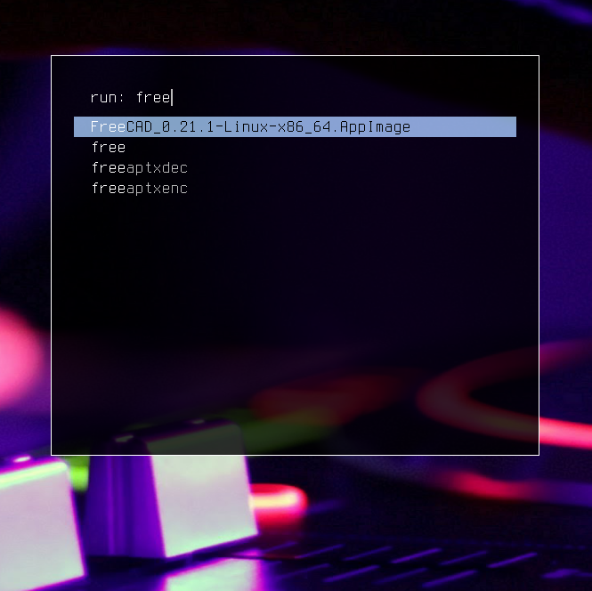

dmenu (fork)
============

This is a fork of the suckless [dmenu](https://tools.suckless.org/dmenu). This fork merges the following patches: 

- dmenu-alpha: adds transparency to the dmenu background
- dmenu-bar-height: allows changing the height of individual items in the list
- dmenu-border: adds a border around the dmenu prompt
- dmenu-caseinsensitive: defaults to insensitive by default, unless -s is passed
- dmenu-center: centers the dmenu prompt in the middle of the screen (always on)
- dmenu-fuzzymatch: toggle fuzzy matching with the -F flag
- dmenu-fuzzyhighlight: highlights matching results
- dmenu-linebelowprompt-and-fullwidth: show menu entries bellow the prompt
- dmenu-mousesupport: adds support for mouse 
- dmenu-multiselect: multiple items can be selected with control+enter or control+click, using the -M flag
- dmenu-password: hides the keyboard input and instead replaces it with a character, using the -P flag
- dmenu-numbers: show the total number of matches over the total number of items in the up-right corner, using the -n flag
- dmenu_run_history: replaces dmenu_run so we always get history 

And adds the following other changes: 
- always vertical/centered: there is no longer a horizontal mode
- using libconfig to loads configuration from `$XDG_CONFIG_HOME/dmenu/dmenu.cfg` if it exists
- margin and padding: can be configured in `config.h` or `dmenu.cfg`
- inputless mode using the -i flag
- prioritize history items over exact matches

Building and installing
=======================

1. clone this repository locally on your machine
2. Install libconfig from your package manager
3. run `make && sudo make install` from within the repository folder
4. copy and edit the config file: `cp /etc/dmenu/dmenu.cfg $XDG_CONFIG_HOME/dmenu/dmenu.cfg`

Preview
=======

