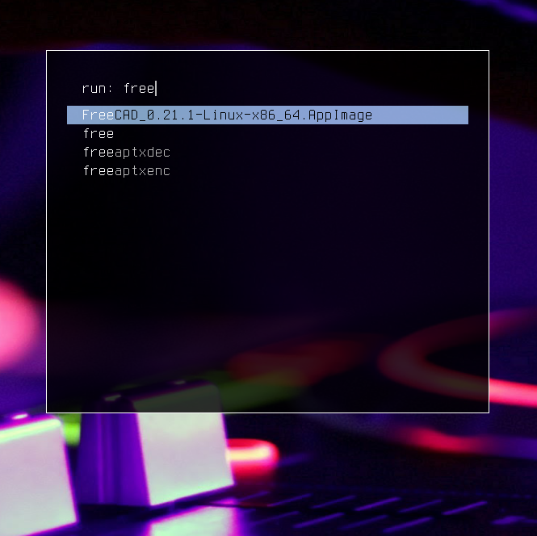
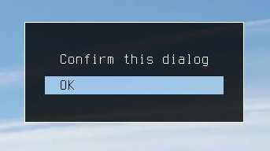
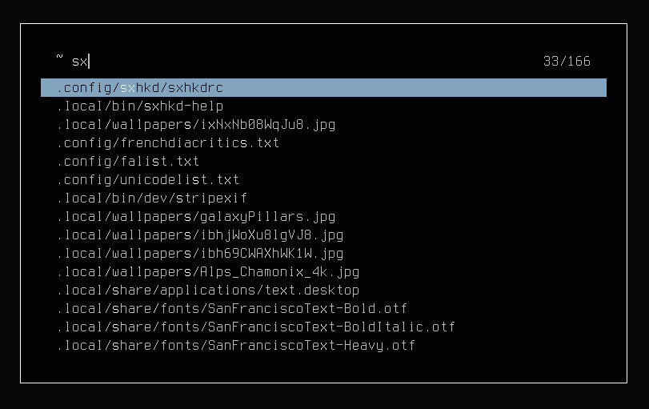

dmenu (fork)
============

A bloated fork of suckless [dmenu](https://tools.suckless.org/dmenu) with lots of customizations.

This fork merges the following patches: 

- [dmenu-alpha](https://tools.suckless.org/dmenu/patches/alpha/): adds transparency
- [dmenu-bar-height](https://tools.suckless.org/dmenu/patches/bar_height/): changes height of items
- [dmenu-border](https://tools.suckless.org/dmenu/patches/border/): adds a border
- [dmenu-caseinsensitive](https://tools.suckless.org/dmenu/patches/case-insensitive/): adds case-sensitivity
- [dmenu-center](https://tools.suckless.org/dmenu/patches/center/): centers dmenu
- [dmenu-fuzzymatch](https://tools.suckless.org/dmenu/patches/fuzzymatch/): fuzzy matching
- [dmenu-fuzzyhighlight](https://tools.suckless.org/dmenu/patches/fuzzyhighlight/): highlights matching results
- [dmenu-initialtext](https://tools.suckless.org/dmenu/patches/initialtext/): starts dmenu with user input
- [dmenu-linebelowprompt-and-fullwidth](https://tools.suckless.org/dmenu/patches/lines-below-prompt/): show entries below prompt
- [dmenu-mousesupport](https://tools.suckless.org/dmenu/patches/mouse-support/): mouse support
- [dmenu-multiselect](https://tools.suckless.org/dmenu/patches/multi-selection/): allows multiple items to be selected
- [dmenu-numbers](https://tools.suckless.org/dmenu/patches/numbers/): show number of matches/items
- [dmenu-password](https://tools.suckless.org/dmenu/patches/password/): hides keyboard input with characters
- [dmenu-printindex](https://tools.suckless.org/dmenu/patches/printindex/): prints index of item instead of item
- [dmenu_run_history](https://tools.suckless.org/dmenu/scripts/dmenu_run_with_command_history/): dmenu_run with history

And adds the following other changes: 

- **always vertical/centered**; there is no longer a horizontal mode
- **configuration file**; loads configuration from `$XDG_CONFIG_HOME/dmenu/dmenu.toml` if it exists
- **margin and padding**; can be configured in `config.h` or `dmenu.toml`
- **inputless mode** using the -i flag
- **prioritize history** items over exact matches
- **faster** width calculation of large files
- **minimum width** can be specified with the -W flag

Have a look at [dmenu.toml](dmenu.toml)!

Building and installing
-----------------------

1. clone this repository locally on your machine
2. run `make clean && sudo make install` from within the repository folder
3. copy and edit the config file: `cp /etc/dmenu/dmenu.toml $XDG_CONFIG_HOME/dmenu/dmenu.toml`

Previews
--------

### dmenu_run with history, which prioritize history items over exact matches 
`dmenu_run`

***

### dmenu as a password prompt
`dmenu -p "Enter password:" -P -W 300`

***

### dmenu as a confirmation dialog; with input disabled
`echo "OK" | dmenu -p "Confirm this dialog" -i -W 0`

***

### Edit dotfiles; fuzzy matching enabled & numbers displayed
`select=$(find ~ -type f | dmenu -F -n -p "~") && [[ -n $select ]] && $TERMINAL -e $EDITOR $select`

